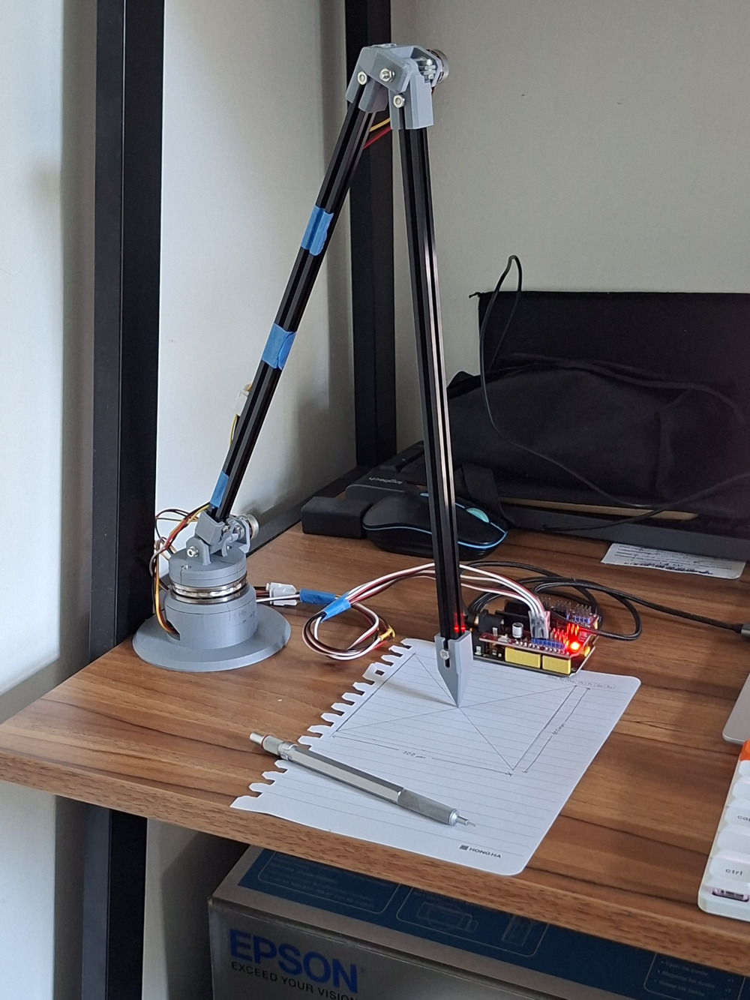

# 3d-measurement-arm

This repository contains the CAD models and code for a 3-dof passive robot arm to precisely measure the location tracked at its tip. An image of the arm can be found at the bottom of this page.

## cad models

The arm was designed in Onshape; the CAD files can be viewed [here](https://cad.onshape.com/documents/83a4287f1f28db54d5d4cb72/w/bd2aa29ac4ad8f785be7963a/e/9be9df0c600aa734e9bd7037?renderMode=0&uiState=6a1af5c3c6c4554c437d1f73).

## features

- measures the end effector location up to an accuracy of 3-4mm
- optimiser for improving measurement of the arm parameters (link lengths, joint angle offsets, etc.)
- script to make another robot arm mimick the motions recorded in real time

## todo

- unified calibration script linking gravitational DH parameter optimisation to the live endpoint position calculation

## folder summary

encoder arm:

- `arduino`: arduino code required to interface with the potentiometers (using PlatformIO)
- `autocal`: some utilities to help the tuning process
- `grav`: gravitational search algorithm used to output the optimum DH parameters for the arm
- `starter`: some basic scripts for logging data from the arm

related code:

- `sync.py`: script to control a 5-dof robot arm to match the motions of the encoder arm
- `ika`: inverse kinematics powering the sync script

## photos

